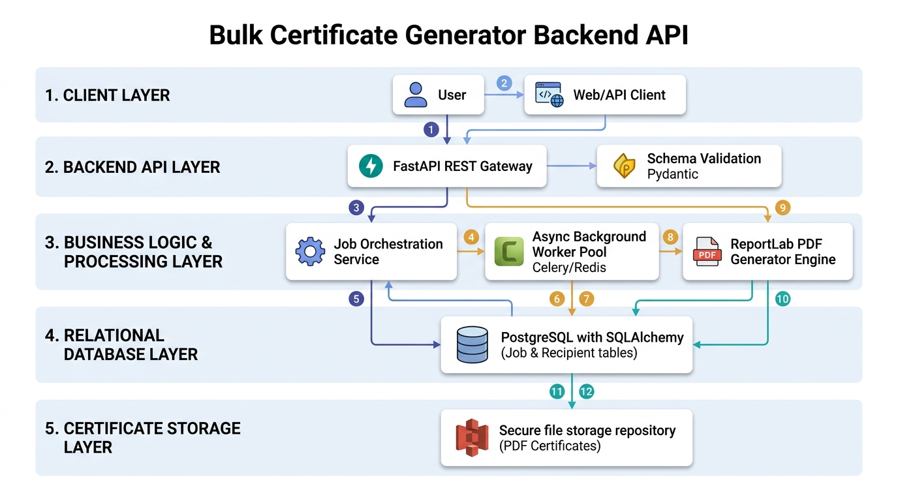
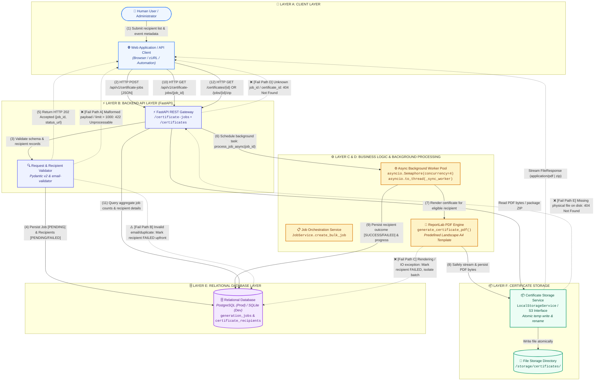
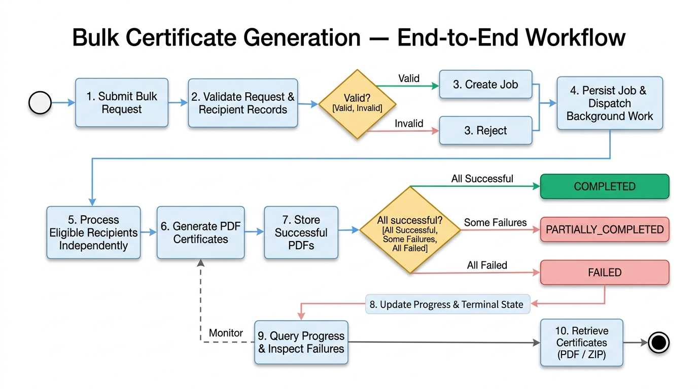

# Bulk Certificate Generator Backend API

[](https://www.python.org/)
[](https://fastapi.tiangolo.com)
[](https://www.sqlalchemy.org/)
[](https://docs.pydantic.dev/)
[](https://www.reportlab.com/)
[-brightgreen.svg)]()
[]()
[](https://miro.com/app/board/uXjVEcUMw4w=/?share_link_id=299247660343)

> A production-grade, asynchronous REST API designed for high-throughput bulk certificate generation. The engine validates batch recipient payloads, generates personalized, vector-grade PDF certificates from an official predefined template, tracks progress in real-time with resilient failure isolation, and serves single-file or compressed bulk ZIP downloads.

---

## Table of Contents

- [1. Executive Architectural Overview](#1-executive-architectural-overview)
- [2. System Architecture Diagram](#2-system-architecture-diagram)
- [3. Architectural Layers & Component Details](#3-architectural-layers--component-details)
- [4. Numbered End-to-End Request Flow (1–12)](#4-numbered-end-to-end-request-flow-112)
- [5. Architecture Legend & Failure Path Catalog](#5-architecture-legend--failure-path-catalog)
- [6. End-to-End Workflow Diagram](#6-end-to-end-workflow-diagram)
- [7. Workflow Stages & Decision Matrix](#7-workflow-stages--decision-matrix)
- [8. Predefined Certificate Template Design](#8-predefined-certificate-template-design)
- [9. Architectural Assumptions & Production Matrix](#9-architectural-assumptions--production-matrix)
- [10. REST API Reference](#10-rest-api-reference)
- [11. Quickstart & Verification](#11-quickstart--verification)

---

## 1. Executive Architectural Overview

The **Bulk Certificate Generator Backend API** is engineered around principles of bounded asynchronous execution, strict recipient-level failure isolation, and defense-in-depth persistence. Unlike naive batch processors that abort on the first encountered error, this architecture treats every recipient within a bulk payload as an independent unit of work.

```
       +---------------------------------------------------------------------------------+
       |                               CORE HIGHLIGHTS                                  |
       +---------------------------------------------------------------------------------+
       | ⚡ Asynchronous Orchestration : Immediate HTTP 202 Accepted + background worker  |
       | 🛡️ Strict Fault Isolation     : 1 failing recipient never fails the batch       |
       | 🎨 Vector PDF Engine          : ReportLab Canvas with auto-scaling typography   |
       | 🔒 Safe Storage Abstraction   : Path traversal prevention & atomic temp renames |
       | 📊 Aggregate State Tracking   : Real-time queries for pending/processing/done   |
       +---------------------------------------------------------------------------------+
```

---

## 2. System Architecture Diagram

<p align="center">
  
</p>

The visual diagram above and the interactive specification below map all architectural layers, the primary numbered execution path (1 through 12), and explicit failure branches.



---

## 3. Architectural Layers & Component Details

### Layer A: Client Layer
- **Actor (User)**: Event coordinator or automated system initiating batch credential generation.
- **Client Client Interface**: Web single-page application (SPA), mobile application, or automation script (cURL, Python SDK, CI/CD pipeline).
- **Responsibilities**:
  1. Compiles recipient name list, event title, issuance date, and duplicate resolution policy into a single JSON payload.
  2. Submits batch job via HTTP `POST` and captures the returned `job_id` and tracking hypermedia links.
  3. Polls execution progress via HTTP `GET` to display live progress bars (`pending`, `processing`, `successful`, `failed`).
  4. Triggers single certificate PDF downloads or downloads the unified bulk ZIP bundle upon completion.

### Layer B: Backend API Layer (FastAPI Framework)
- **Technology**: Python 3.11+, FastAPI, Uvicorn ASGI server.
- **Request / Response Schemas**: Pydantic v2 schemas (`JobCreateRequest`, `JobCreateResponse`, `JobDetailResponse`, `RecipientResponse`).
- **REST Endpoints**:
  - `POST /api/v1/certificate-jobs`: Initiates a new bulk generation workflow.
  - `GET /api/v1/certificate-jobs/{job_id}`: Obtains job status, counters, and detailed recipient outcomes.
  - `GET /api/v1/certificate-jobs/{job_id}/zip`: Generates and streams a compressed ZIP archive containing all successful certificates.
  - `GET /api/v1/certificates/{certificate_id}`: Securely streams a single personalized PDF.
  - `GET /api/v1/health`: Liveness probe reporting database connectivity and storage status.
- **Authentication & Validation Gateway**: Validates structural payloads, enforces maximum recipient thresholds (`MAX_RECIPIENTS_PER_JOB = 1000`), handles CORS, and sanitizes untrusted input.

### Layer C: Business Logic & Certificate Generation
- **Job Service (`JobService`)**: Coordinates the lifecycle transitions of jobs (`PENDING` → `PROCESSING` → `COMPLETED` | `PARTIALLY_COMPLETED` | `FAILED`).
- **Validation Engine (`validate_recipient_data`)**: Validates recipient names and email addresses via `email-validator` (RFC-compliant syntax check without network DNS blocking). Applies the selected `duplicate_policy` (`mark_failed`, `deduplicate`, `allow`).
- **PDF Engine (`pdf_engine.py`)**: Uses ReportLab Canvas to dynamically render vector-grade certificates.
  - Predefined landscape A4 format (841.89 × 595.27 points).
  - Dynamic font autoscaling: shrinks recipient names down from 36pt and event titles down from 24pt to avoid boundary overflow, with graceful ellipsis clipping.
  - High-precision geometric double borders, gold verification medallion seal, and audit certificate serials.

### Layer D: Background Processing & Concurrency
- **Asynchronous Task Dispatcher**: Utilizes FastAPI `BackgroundTasks` to free the HTTP request-response cycle immediately.
- **Bounded Worker Pool**:
  - Controlled by an `asyncio.Semaphore(MAX_CONCURRENT_WORKERS)` (default: 4 concurrent workers).
  - Heavy CPU-bound PDF rendering and disk I/O run inside dedicated worker threads via `asyncio.to_thread()`.
- **Fault-Tolerant Session Isolation**: Each worker thread provisions an independent, short-lived SQLAlchemy session (`SessionLocal()`), preventing thread-safety violations and connection poisoning.
- **Per-Recipient Isolation**: Any runtime failure during the rendering or saving of recipient $N$ is caught in a localized `try/except` block, logged with a sanitized error message, persisted as `status="FAILED"` in the database, and does not interfere with recipient $N+1$.

### Layer E: Relational Database Layer
- **ORM / Persistence**: SQLAlchemy 2.0 with Alembic schema migration management.
- **Databases Supported**: SQLite for lightweight zero-dependency local development and automated CI testing; PostgreSQL for production multi-worker environments.
- **Entity Model**:
  - `generation_jobs`: Primary job table holding aggregate counters (`total_recipients`, `successful_count`, `failed_count`), event metadata, timestamps, and overall job status.
  - `certificate_recipients`: Granular recipient records storing `recipient_name`, `recipient_email`, status, unique `certificate_id` (`CERT-XXXXXXXX-XXXX`), `storage_key`, file sizes, and detailed error codes.
- **Indexing Strategy**: Composite index on `(job_id, status)` for fast progress aggregations and index on `(status, created_at)` for operational monitoring.

### Layer F: Certificate Storage Layer
- **Storage Abstraction (`BaseStorageService`)**: Abstract base class allowing drop-in replacement between local disk storage and cloud object storage (Amazon S3 / Google Cloud Storage / Azure Blob Storage).
- **Local Implementation (`LocalStorageService`)**:
  - Path traversal defense: validates every requested `storage_key` using `path.relative_to(base_dir)`.
  - Atomic write operations: PDF bytes are flushed to a temporary file (`.tmp_cert_*`) and atomically renamed via `os.replace` to prevent truncated files if the host process terminates unexpectedly.
  - Lifecycle Cleanup: Temporary ZIP archives created for batch downloads are cleaned up via a background task immediately after file streaming finishes.

---

## 4. Numbered End-to-End Request Flow (1–12)

The system fulfills the complete certificate generation and retrieval cycle through twelve synchronized operations:

```
[1] User Submits Data ---> [2] Client POST Request ---> [3] Schema & Recipient Validation
                                                                     |
[5] Return HTTP 202 <--- [4] Persist Initial Records <---------------+
         |
[6] Background Dispatch ---> [7] PDF Generation ---> [8] Atomic Storage Write
                                                            |
[10] Client Polls Status <--- [9] Persist Recipient Status & Update Aggregate Job
         |
[11] Query DB Counts & Recipient Outcomes
         |
[12] Client Downloads PDF or Bulk ZIP Archive
```

### Detailed Step-by-Step Breakdown

1. **Step 1 — Bulk Submission (User → Client)**:
   The user provides the event title (e.g., *"Cloud Architecture Bootcamp 2026"*), issue date, duplicate email handling policy, and a list of recipient names and email addresses.
2. **Step 2 — HTTP POST Request (Client → Backend API)**:
   The client issues `POST /api/v1/certificate-jobs` containing the JSON payload.
3. **Step 3 — Request & Recipient Validation (API → Validation Layer)**:
   FastAPI parses the body against `JobCreateRequest`. The validator verifies non-empty event names, dates, and recipient lists ($1 \le N \le 1000$). Each recipient is passed to `validate_recipient_data()` to check email formatting and duplicates.
4. **Step 4 — Database Persistence (Validation Layer → Relational Database)**:
   `JobService.create_bulk_job()` generates a UUIDv4 `job_id`, records the job in `generation_jobs`, and bulk-inserts all recipient records into `certificate_recipients`. Valid recipients receive `status="PENDING"`; invalid recipients are marked `status="FAILED"` upfront with specific error codes.
5. **Step 5 — Asynchronous Acceptance Response (API → Client)**:
   The API responds immediately with **`HTTP 202 Accepted`** containing the `job_id`, initial status (`PENDING`), total recipients, and a hypermedia `status_url`.
6. **Step 6 — Background Task Dispatch (API → Background Worker Pool)**:
   FastAPI's `BackgroundTasks` executes `JobService.process_job_async(job_id)`. The job transitions to `status="PROCESSING"`.
7. **Step 7 — Certificate Rendering (Worker → PDF Engine)**:
   For each pending recipient, an async worker thread invokes `generate_certificate_pdf()` with recipient details, event metadata, and a unique certificate identifier (`CERT-XXXXXXXX-XXXX`).
8. **Step 8 — Storage Persistence (PDF Engine → Storage Service)**:
   The generated PDF byte buffer is passed to `storage_service.save_file()`. The file is written atomically to the storage location under a unique key (`{cert_id}_{sanitized_name}.pdf`).
9. **Step 9 — Outcome Persistence & Progress Refresh (Worker → Database)**:
   Upon successful write, the recipient is updated to `status="SUCCESS"` with its `certificate_id`, `storage_key`, and `file_size_bytes`. If an exception occurs, the local transaction is rolled back, and the recipient is marked `status="FAILED"`. When all recipients conclude, live database counts determine the final terminal job state: `COMPLETED`, `PARTIALLY_COMPLETED`, or `FAILED`.
10. **Step 10 — Job Progress Polling (Client → Backend API)**:
    The client periodically issues `GET /api/v1/certificate-jobs/{job_id}` to inspect current execution counters.
11. **Step 11 — Database Query (Backend API → Relational Database)**:
    `JobService.get_job_detail()` reads the job and recipient records from the database to build the response payload.
12. **Step 12 — Certificate Retrieval (Client → API → Storage)**:
    - **Single Certificate**: Client calls `GET /api/v1/certificates/{certificate_id}`. The API validates the certificate, verifies physical presence on disk, and streams the PDF inline.
    - **Bulk ZIP Archive**: Client calls `GET /api/v1/certificate-jobs/{job_id}/zip`. The API compresses all successful certificates into a temporary ZIP file, streams it as `application/zip`, and schedules a post-response cleanup task to delete the temporary archive.

---

## 5. Architecture Legend & Failure Path Catalog

### Flow Legend

| Arrow Style | Visual Meaning | Typical Operation |
|:---|:---|:---|
| **Solid Arrow (`-->`)** | Primary Synchronous Request / Data Flow | HTTP API call, service invocation, database transaction |
| **Dashed Arrow (`-.->`)** | Asynchronous / Response / Failure Flow | Background dispatch, HTTP responses, error branches |
| **Double Border (`[("...")]`)** | Stateful Persistence Store | Relational database table or physical filesystem directory |
| **Rounded Box (`([...])`)** | External Actor | Human user, client agent, or external system |

### Failure Path Catalog & Resilience Matrix

```
       +---------------------------------------------------------------------------------------+
       | FAIL PATH | TRIGGER CONDITION                   | SYSTEM RESPONSE & RECOVERY          |
       +-----------+-------------------------------------+-------------------------------------+
       | Path A    | Invalid JSON / Empty Event Name /   | HTTP 422 Unprocessable Entity with  |
       |           | Batch size > 1,000 recipients       | detailed Pydantic validation trace. |
       |-----------+-------------------------------------+-------------------------------------|
       | Path B    | Malformed email syntax / duplicate  | Upfront recipient isolation: marked |
       |           | email within batch under policy     | FAILED in DB; valid items proceed.  |
       |-----------+-------------------------------------+-------------------------------------|
       | Path C    | PDF rendering crash / disk write    | Handled in worker: recipient set to |
       |           | failure during processing           | FAILED with error code; batch runs. |
       |-----------+-------------------------------------+-------------------------------------|
       | Path D    | Nonexistent job_id or cert_id       | HTTP 404 Not Found with explicit    |
       |           | queried by client                   | error diagnostic message.           |
       |-----------+-------------------------------------+-------------------------------------|
       | Path E    | Storage metadata exists in DB but   | HTTP 404 Not Found: "Storage file   |
       |           | file is missing on storage backend  | could not be located on server."    |
       +---------------------------------------------------------------------------------------+
```

---

## 6. End-to-End Workflow Diagram

<p align="center">
  
</p>

> 🔗 **Interactive Workflow Canvas (Miro Board)**:  
> For more workflow details, interactive canvas exploration, and zoomable step-by-step breakdowns, [**click here to view the official Miro Workflow Diagram**](https://miro.com/app/board/uXjVEcUMw4w=/?share_link_id=299247660343).

The visual workflow diagram above and the flowchart below illustrate the ten operational stages, explicit decision diamonds, failure branching, and the three terminal job states.

```mermaid
flowchart TD
    %% ========================================================
    %% WORKFLOW DIAGRAM: BULK CERTIFICATE GENERATION
    %% ========================================================

    Start([Start: Client initiates bulk generation]) --> Stage1["<b>STAGE 1:</b> Submit Bulk Request<br/><code>POST /api/v1/certificate-jobs</code><br/><i>Payload: event_name, issue_date, recipients[]</i>"]

    Stage1 --> Stage2["<b>STAGE 2:</b> Validate Request & Recipient Records<br/><i>Schema validation & email syntax inspection</i>"]

    Stage2 --> Decision1{"<b>DECISION 1:</b><br/>Is the overall<br/>request valid?"}

    Decision1 -- "No (Malformed / Exceeds 1000)" --> RejectRequest["<b>STAGE 3A:</b> Reject Invalid Request<br/>Return <code>HTTP 422 / 400</code><br/><i>Execution terminates immediately</i>"]
    RejectRequest --> EndFail([End: Request Rejected])

    Decision1 -- "Yes (Valid Request)" --> Stage3B["<b>STAGE 3B:</b> Create Job Record & Recipients<br/><i>Partition recipients into PENDING vs upfront FAILED</i>"]

    Stage3B --> Stage4["<b>STAGE 4:</b> Persist Job & Dispatch Background Task<br/>1. Commit Job & Recipients to Relational DB<br/>2. Return <code>HTTP 202 Accepted</code> to Client<br/>3. Dispatch <code>process_job_async()</code>"]

    Stage4 --> Stage5["<b>STAGE 5:</b> Process Eligible Recipients Independently<br/><i>Iterate over PENDING recipients in bounded concurrency pool</i>"]

    Stage5 --> Decision2{"<b>DECISION 2:</b><br/>Is this recipient<br/>record valid?"}

    Decision2 -- "No (Syntax / Duplicate)" --> MarkRecipientFail["Record Recipient Status = FAILED<br/><i>Persist error_code & message in DB</i>"]

    Decision2 -- "Yes (Valid Recipient)" --> Stage6["<b>STAGE 6:</b> Generate PDF Certificate<br/><i>Render A4 template with dynamic typography</i>"]

    Stage6 --> Decision3{"<b>DECISION 3:</b><br/>Was certificate<br/>generated & stored<br/>successfully?"}

    Decision3 -- "No (Engine / IO Error)" --> MarkRecipientFail
    Decision3 -- "Yes (Success)" --> Stage7["<b>STAGE 7:</b> Store PDF & Persist Outcome<br/>1. Save PDF via StorageService (atomic rename)<br/>2. Update Recipient: status=SUCCESS, cert_id, storage_key"]

    MarkRecipientFail --> CheckMore{"<b>DECISION 4:</b><br/>Are all recipients<br/>in a terminal<br/>state?"}
    Stage7 --> CheckMore

    CheckMore -- "No (Recipients remaining)" --> Stage5
    CheckMore -- "Yes (All completed)" --> Stage8["<b>STAGE 8:</b> Update Progress & Finalize Job Status<br/><i>Recalculate dynamic database counts & set terminal status</i>"]

    Stage8 --> TerminalDecision{"Evaluate Final<br/>Job Outcome"}

    TerminalDecision -- "Successful == Total" --> JobCompleted["Job Status: <b>COMPLETED</b><br/><i>All certificates generated</i>"]
    TerminalDecision -- "Successful > 0 & Failed > 0" --> JobPartial["Job Status: <b>PARTIALLY_COMPLETED</b><br/><i>Some certificates generated, some failed</i>"]
    TerminalDecision -- "Successful == 0" --> JobFailed["Job Status: <b>FAILED</b><br/><i>All recipient generation attempts failed</i>"]

    JobCompleted --> Stage9["<b>STAGE 9:</b> Query Progress & Inspect Failures<br/>Client polls <code>GET /api/v1/certificate-jobs/{job_id}</code>"]
    JobPartial --> Stage9
    JobFailed --> Stage9

    Stage9 --> Stage10["<b>STAGE 10:</b> Retrieve Generated Certificates<br/>• Single PDF: <code>GET /api/v1/certificates/{id}</code><br/>• Bulk ZIP: <code>GET /api/v1/certificate-jobs/{id}/zip</code>"]

    Stage10 --> EndSuccess([End: Retrieval Complete])

    %% ========================================================
    %% WORKFLOW STYLING
    %% ========================================================
    classDef startEnd fill:#F1F5F9,stroke:#64748B,stroke-width:2px,color:#0F172A;
    classDef stageBox fill:#EFF6FF,stroke:#2563EB,stroke-width:2px,color:#1E3A8A;
    classDef decisionBox fill:#FEF3C7,stroke:#D97706,stroke-width:2px,color:#78350F;
    classDef terminalSuccess fill:#DCFCE7,stroke:#16A34A,stroke-width:2px,color:#14532D;
    classDef terminalPartial fill:#FEF9C3,stroke:#CA8A04,stroke-width:2px,color:#713F12;
    classDef terminalFail fill:#FEE2E2,stroke:#DC2626,stroke-width:2px,color:#7F1D1D;

    class Start,EndSuccess,EndFail startEnd;
    class Stage1,Stage2,Stage3B,Stage4,Stage5,Stage6,Stage7,Stage8,Stage9,Stage10 stageBox;
    class Decision1,Decision2,Decision3,CheckMore,TerminalDecision decisionBox;
    class JobCompleted terminalSuccess;
    class JobPartial terminalPartial;
    class JobFailed,RejectRequest,MarkRecipientFail terminalFail;
```



---

## 7. Workflow Stages & Decision Matrix

```
       +---------------------------------------------------------------------------------+
       | STAGE     | NAME                         | DETAILED SYSTEM OPERATION            |
       +-----------+------------------------------+--------------------------------------+
       | Stage 1   | Submit Bulk Request          | Client submits JSON payload via POST |
       | Stage 2   | Validate Request & Records   | Pydantic checks schema & constraints |
       | Stage 3   | Job Creation / Rejection     | Rejects bad schema or initializes DB |
       | Stage 4   | Persist Job & Dispatch Work  | Commits initial state & starts async |
       | Stage 5   | Bounded Recipient Processing | Concurrency-limited processing loop  |
       | Stage 6   | Generate PDF Certificate     | ReportLab vector rendering           |
       | Stage 7   | Store PDF & Persist Result   | Atomic write & DB update per item    |
       | Stage 8   | Finalize Job Status          | Aggregate state -> terminal status   |
       | Stage 9   | Inspect Progress & Failures  | Client queries live progress counters|
       | Stage 10  | Certificate Retrieval        | Stream single PDF or bulk ZIP archive|
       +---------------------------------------------------------------------------------+
```

### Decision Logic Breakdown

1. **Decision 1: Is the overall request valid?**
   - **Check**: Validates JSON formatting, event name presence, issue date structure, and ensures $1 \le \text{recipients} \le 1000$.
   - **Branch [No]**: Immediate rejection with HTTP 422 / 400. No database records are created.
   - **Branch [Yes]**: Proceeds to Job Initialization.

2. **Decision 2: Is this recipient record valid?**
   - **Check**: Validates name presence, RFC-compliant email syntax, and batch uniqueness per `duplicate_policy`.
   - **Branch [No]**: Marked as `status="FAILED"` with error code (`INVALID_NAME`, `INVALID_EMAIL`, or `DUPLICATE_RECIPIENT_IN_BATCH`). **Does not stop remaining recipients.**
   - **Branch [Yes]**: Marked as `status="PENDING"` and queued for generation.

3. **Decision 3: Was certificate generated and stored successfully?**
   - **Check**: Evaluates whether the ReportLab engine rendered non-empty bytes and whether `storage_service.save_file()` completed atomic disk write.
   - **Branch [No]**: Caught by isolated handler; database transaction is rolled back; recipient is marked `FAILED` with sanitized error message (`GENERATION_FAILED`).
   - **Branch [Yes]**: Recipient updated to `SUCCESS`, storing certificate ID, file path, and byte size.

4. **Decision 4: Are all recipients in a terminal state?**
   - **Check**: Evaluates whether any recipient records for the job remain in `PENDING` or `PROCESSING` state.
   - **Branch [No]**: Worker continues through remaining items.
   - **Branch [Yes]**: Re-queries persisted database counts and assigns terminal job state:
     - **COMPLETED**: `successful_count == total_recipients`
     - **PARTIALLY_COMPLETED**: `successful_count > 0` and `failed_count > 0`
     - **FAILED**: `successful_count == 0`

---

## 8. Predefined Certificate Template Design

Every generated credential adheres to a standardized, vector-based landscape layout generated via ReportLab:

```
+-----------------------------------------------------------------------------------------+
| [Slate-900 Outer Border (6pt)]                                                          |
|   +---------------------------------------------------------------------------------+   |
|   | [Amber-600 Inner Gold Border (2pt)]                                             |   |
|   |   [Corner Navy Geometrics]                                                      |   |
|   |                                                                                 |   |
|   |                      OFFICIAL CERTIFICATE OF COMPLETION                         |   |
|   |                         CERTIFICATE OF EXCELLENCE                               |   |
|   |                         =========================                               |   |
|   |                                                                                 |   |
|   |                            PROUDLY PRESENTED TO                                 |   |
|   |                                                                                 |   |
|   |                              Jane Doe, M.Sc.                                    |   |
|   |                        -----------------------------                            |   |
|   |                                                                                 |   |
|   |        in recognition of successful completion and outstanding performance in    |   |
|   |                                                                                 |   |
|   |               Advanced Cloud Engineering & Distributed Systems                   |   |
|   |                                                                                 |   |
|   |            [Date]                     ( ( VERIFIED ) )            [Signatory]   |   |
|   |         October 9, 2026                 ( DIGITAL  )           Program Director |   |
|   |       Date of Issuance                (CREDENTIAL) )                            |   |
|   |                                                                                 |   |
|   |     Certificate ID: CERT-A1B2C3D4-E5F6  |  Authenticity Guaranteed              |   |
|   +---------------------------------------------------------------------------------+   |
+-----------------------------------------------------------------------------------------+
```

### Template Features
- **Format**: Landscape A4 ($841.89 \times 595.27$ PostScript points).
- **Dynamic Font Autoscaling**:
  - Recipient Name: default 36pt Times-BoldItalic; automatically steps down to 12pt for lengthy names.
  - Event Name: default 24pt Helvetica-Bold; automatically steps down to 10pt for verbose course titles.
  - Ellipsis Clipping: Gracefully truncates text with `...` if names still exceed printable bounds at minimum font sizes.
- **Visual Elements**:
  - Double border frame: Outer Slate-900 (`#0F172A`) + Inner Amber-600 (`#D97706`).
  - Corner vector geometric accents in Dark Navy (`#1E3A8A`).
  - Circular gold verification medallion seal at center base (`#FEF3C7` fill with `#92400E` lettering).
  - Two-column bottom metadata: Date of Issuance and Authorized Signatory.
  - Unique audit serial string: `CERT-{UUID[:8]}-{UUID[9:13]}` printed in Courier.

---

## 9. Architectural Assumptions & Production Matrix

The architecture cleanly balances local simplicity with production scalability:

| Architecture Component | Current Implementation | Production-Ready Alternative | Architectural Rationale |
|:---|:---|:---|:---|
| **Web Framework** | FastAPI 0.115+ (Python) | FastAPI on AWS ECS / Kubernetes | High-performance asynchronous routing, native Pydantic v2 validation, built-in OpenAPI schema generation. |
| **Relational Database** | SQLite (`certificates.db`) | PostgreSQL 15+ / AWS Aurora | SQLite provides zero-dependency setup for testing; PostgreSQL offers multi-pod connection pooling and robust concurrent writes. |
| **Background Processing** | FastAPI `BackgroundTasks` + `asyncio.Semaphore(4)` | Celery / RQ + Redis Broker | In-process queue requires no external message broker for single-instance deployments; distributed brokers are recommended for horizontal scaling. |
| **PDF Rendering Engine** | ReportLab 4.2+ (Canvas API) | ReportLab / Weasyprint Sidecar | Pure Python vector generation without headless browser dependencies (e.g., Puppeteer/Chromium), reducing memory overhead. |
| **Certificate Storage** | `LocalStorageService` (Filesystem) | `S3StorageService` (AWS S3 / GCS) | Modular `BaseStorageService` interface allows swapping local atomic disk storage for S3 by providing a new adapter class. |
| **Batch Archive Strategy** | On-demand dynamic ZIP packaging | Pre-aggregated S3 ZIP / Signed URLs | Asynchronous background cleanup purges temporary local ZIP archives after HTTP response streaming finishes. |

---

## 10. REST API Reference

### 1. Submit Bulk Certificate Job
- **Endpoint**: `POST /api/v1/certificate-jobs`
- **Status Code**: `202 Accepted`
- **Request Body**:
```json
{
  "event_name": "Full Stack Cloud Architecture Masterclass",
  "issue_date": "2026-10-09",
  "duplicate_policy": "mark_failed",
  "recipients": [
    { "name": "Alice Johnson", "email": "alice@example.com" },
    { "name": "Bob Smith", "email": "bob@example.com" },
    { "name": "Charlie Brown", "email": "invalid-email-address" }
  ]
}
```
- **Response Body**:
```json
{
  "job_id": "c7a8e1b2-3c4d-5e6f-7a8b-9c0d1e2f3a4b",
  "status": "PENDING",
  "message": "Certificate generation job accepted for processing.",
  "total_recipients": 3,
  "status_url": "http://localhost:8000/api/v1/certificate-jobs/c7a8e1b2-3c4d-5e6f-7a8b-9c0d1e2f3a4b"
}
```

### 2. Query Job Status & Recipient Breakdown
- **Endpoint**: `GET /api/v1/certificate-jobs/{job_id}`
- **Status Code**: `200 OK`
- **Response Body**:
```json
{
  "id": "c7a8e1b2-3c4d-5e6f-7a8b-9c0d1e2f3a4b",
  "event_name": "Full Stack Cloud Architecture Masterclass",
  "issue_date": "2026-10-09",
  "status": "PARTIALLY_COMPLETED",
  "total_recipients": 3,
  "pending_count": 0,
  "processing_count": 0,
  "successful_count": 2,
  "failed_count": 1,
  "zip_download_url": "http://localhost:8000/api/v1/certificate-jobs/c7a8e1b2-3c4d-5e6f-7a8b-9c0d1e2f3a4b/zip",
  "recipients": [
    {
      "id": "e1f2a3b4-...",
      "recipient_name": "Alice Johnson",
      "recipient_email": "alice@example.com",
      "status": "SUCCESS",
      "certificate_id": "CERT-F89A12B3-4C5D",
      "download_url": "http://localhost:8000/api/v1/certificates/CERT-F89A12B3-4C5D",
      "error_code": null,
      "error_message": null
    },
    {
      "id": "f2a3b4c5-...",
      "recipient_name": "Charlie Brown",
      "recipient_email": "invalid-email-address",
      "status": "FAILED",
      "certificate_id": null,
      "download_url": null,
      "error_code": "INVALID_EMAIL",
      "error_message": "Invalid email format: The email address is missing an @-sign."
    }
  ]
}
```

### 3. Download Single Certificate PDF
- **Endpoint**: `GET /api/v1/certificates/{certificate_id}`
- **Status Code**: `200 OK`
- **Content-Type**: `application/pdf`
- **Content-Disposition**: `inline; filename="Alice_Johnson_CERT-F89A12B3-4C5D.pdf"`

### 4. Download Bulk ZIP Archive
- **Endpoint**: `GET /api/v1/certificate-jobs/{job_id}/zip`
- **Status Code**: `200 OK`
- **Content-Type**: `application/zip`
- **Content-Disposition**: `attachment; filename="certificates_job_c7a8e1b2.zip"`

---

## 11. Quickstart & Verification

### Prerequisites
- Python 3.11 or higher
- Git

### Installation
```bash
# 1. Clone repository
git clone https://github.com/your-org/Bulk_Certificate_Generator_Backend.git
cd Bulk_Certificate_Generator_Backend

# 2. Create virtual environment
python -m venv venv
# Windows:
.\venv\Scripts\activate
# Linux/macOS:
source venv/bin/activate

# 3. Install dependencies
pip install -r requirements.txt
```

### Environment Configuration
Copy the example environment configuration:
```bash
cp .env.example .env
```
Key configuration settings in `.env`:
```ini
APP_NAME="Bulk Certificate Generator API"
ENVIRONMENT="development"
DEBUG=True
PORT=8000
HOST="0.0.0.0"
DATABASE_URL="sqlite:///./certificates.db"
STORAGE_BACKEND="local"
MAX_CONCURRENT_WORKERS=4
MAX_RECIPIENTS_PER_JOB=1000
```

### Running the API Server Locally
```bash
uvicorn app.main:app --host 0.0.0.0 --port 8000 --reload
```

### Running with Docker & Docker Compose (Production Setup)
To launch the API alongside a dedicated PostgreSQL database container with volume persistence and healthchecks:
```bash
docker compose up --build -d
```
Check container logs and health:
```bash
docker compose ps
docker compose logs -f api
```

Interactive API documentation will be available at:
- **Swagger UI**: `http://localhost:8000/docs`
- **ReDoc**: `http://localhost:8000/redoc`

### Running the Automated Test Suite
Run the full test suite with coverage:
```bash
python -m pytest --cov=app --cov-report=term-missing
```
All 25 test cases cover:
- Batch validation & duplicate policies (`mark_failed`, `deduplicate`, `allow`)
- PDF rendering typography & text auto-scaling
- Bounded concurrency execution and failure isolation
- Path traversal protection and storage access security
- Job status polling, single PDF downloads, and temporary ZIP archive streaming

---

## 12. Security & Resilience Summary

1. **Path Traversal Prevention**: Storage keys are strictly validated and scoped to the base storage directory. Root-relative overrides and `..` segments are rejected with a security exception.
2. **Atomic Writes**: PDFs are written to random temporary files and renamed atomically, preventing incomplete file reads during concurrent access.
3. **Failure Isolation**: An error on any individual recipient updates only that recipient's record and does not abort the broader batch job.
4. **Temporary Resource Cleanup**: ZIP archives generated for bulk downloads are automatically deleted after the response finishes streaming to prevent disk leaks.
